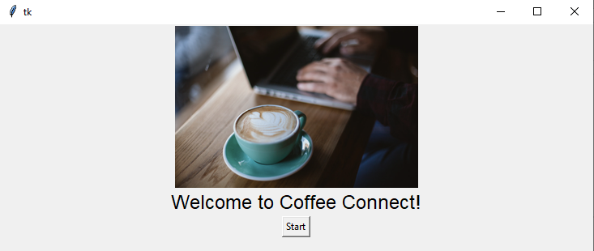
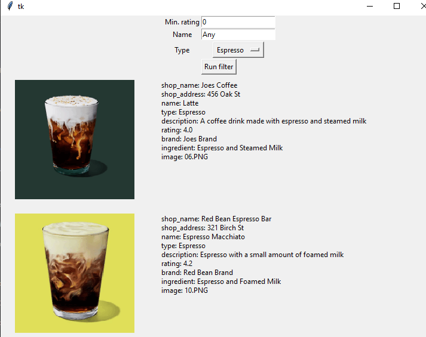
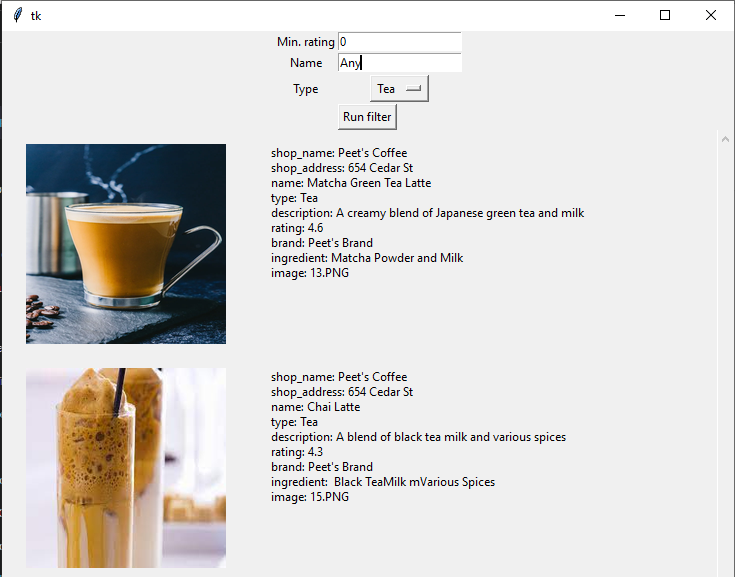

# CoffeeConnect Application

## Description

CoffeeConnect is a GUI application that helps users browse and filter a list of coffee options. The application provides filters such as minimum rating, name, and type of coffee. The coffee information is displayed next to its corresponding image for a better user experience.

## Setup and Installation

### Prerequisites

- Python 3.8+
- Tkinter: It should come pre-installed with Python. If not, install it with `python -m tkinter`.
- PIL (Pillow): Install with `pip install pillow`.
- CSV file with coffee data

### Configuration

1. Clone the repository or download the zip file to your local machine.
2. Ensure you have the `coffee_data.csv` file in the project root directory. The CSV file should include columns for 'image', 'rating', 'name', 'type', etc.

## Usage

1. Run the main script with `[Python CoffeeConnect_HCI584](<Python CoffeeConnect_HCI584.py.py>)`.
    This is what users see when run the application:
    
2. You will first see a welcome page with a 'Start' button. Click the 'Start' button to proceed.
3. You will now see filters for minimum rating and name. Input your preferred filters and click 'Run filter'.
    For example: chosing filter tea and espresso screenshots
    
    
4. The application will now display the coffee options that match the filters, along with their images and other details.
   Exaple of filtering setting with no results:

## Common Errors and Troubleshooting

If you encounter an issue with the image not loading, make sure the image file is located in the correct directory as specified in the CSV file.

## Known Issues and Limitations

- The application currently only supports filtering by minimum rating, name, and type. Other filters could be added in the future.
- The application assumes that the image files are located in a relative directory as specified in the CSV file.

## License

This project is under the MIT license.

