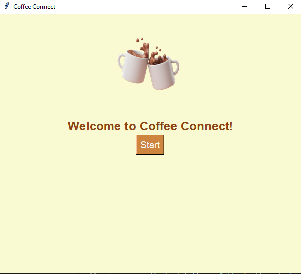
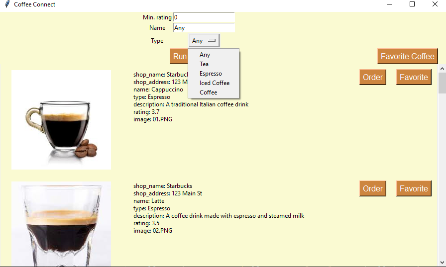
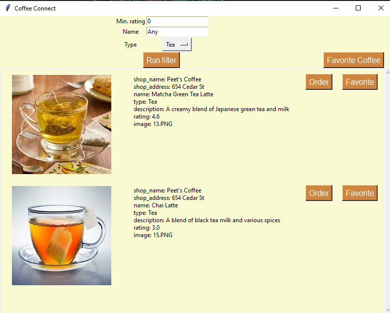
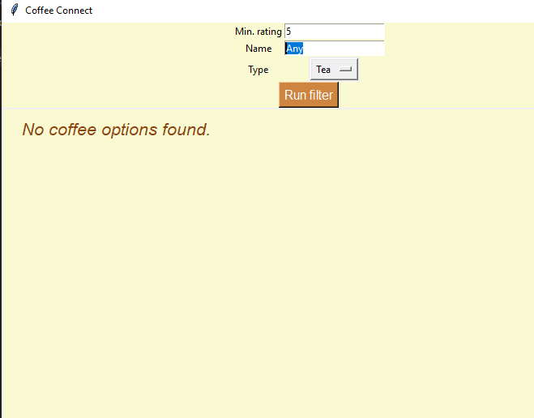
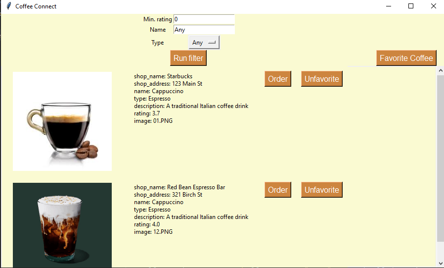
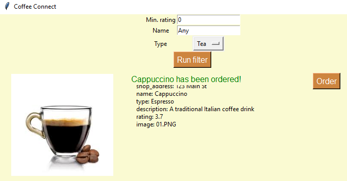

# CoffeeConnect Application - Improved Version

## Description

CoffeeConnect is a user-friendly GUI application designed to help coffee enthusiasts browse, filter, and order their favorite coffees from a diverse range of options. The application provides a seamless experience for users to explore various coffee options, apply filters, mark favorites, and place orders.

## Setup and Installation

### Prerequisites

- Python 3.8+
- Tkinter: It should come pre-installed with Python. If not, install it with `python -m tkinter`.
- PIL (Pillow): Install with `pip install pillow`.
- CSV file with coffee data

### Configuration

1. Clone the repository or download the zip file to your local machine.
2. Ensure you have the `coffee_data.csv` file in the project root directory. The CSV file should include columns for 'image', 'rating', 'name', 'type', etc.

## Usage

1. Run the main script with `[Python CoffeeConnect_HCI584](<Python CoffeeConnect_HCI584.py.py>)`.
2. The application will open to a welcoming page with an inviting coffee icon and a 'Start' button.
   
3. Click the 'Start' button to access the main app page, where you can apply filters to find your desired coffees.
4. The main app page offers three filtering options:
   - Minimum Rating: Set the minimum rating for coffee options.
   - Name: Enter the name of a specific coffee to filter by.
   - Type: Choose a coffee type from the drop-down menu to filter options.
   
5. Input your preferred filters and click the 'Run filter' button to display coffee options that match the filters.
   - Example: Filtering options for "Tea" and "Espresso" types:
   
6. The app will display coffee options along with their images, ratings, names, and types.
   - Example of filtering settings with no results:
   
7. Mark Favorite Coffees: You can mark your favorite coffees by clicking the "Favorite" button next to each coffee option. The "Favorite" button turns into "Unfavorite" when a coffee is marked.
   
8. Access Favorite Coffee: Click the "Favorite Coffee" button to view your list of favorite coffee options. The app displays only the coffee options you have marked as favorites.
  
9. Placing Coffee Orders: To place an order, click the "Order" button next to your desired coffee option. The app will confirm the successful coffee order with a message.
   

## Common Errors and Troubleshooting

- If an image does not load, ensure that the image file is located in the correct directory as specified in the CSV file.
- If you encounter any issues with the filter results, double-check the filter values and spelling to ensure they match the coffee data.

## Known Issues and Limitations

- The application currently supports filtering by minimum rating, name, and type. Additional filters could be added in future updates based on user feedback and needs.
- The app assumes that image files are located in a relative directory as specified in the CSV file. Ensure the file paths are correctly provided in the CSV data.

## License

This project is under the MIT license.

## Conclusion

CoffeeConnect is your ultimate coffee companion, offering a delightful coffee exploration experience. Whether you're a seasoned coffee connoisseur or a curious coffee enthusiast, CoffeeConnect simplifies the process of finding and enjoying your perfect cup of coffee. Download CoffeeConnect today and embark on a delightful coffee adventure!